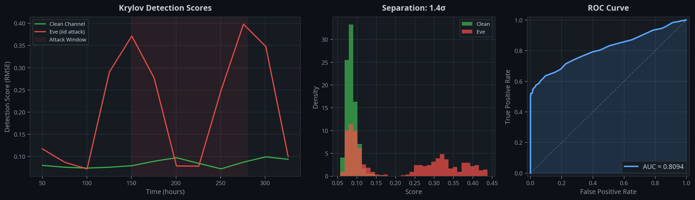

[](https://doi.org/10.5281/zenodo.18889224)
[](https://doi.org/10.5281/zenodo.18940281)
[](https://doi.org/10.5281/zenodo.18939996)
[](https://doi.org/10.5281/zenodo.18957362)
[](https://doi.org/10.5281/zenodo.18959827)
[](LICENSE)
[](https://www.python.org/downloads/)
[](#tests)

# QKD Krylov Detector

A comprehensive eavesdropper detection and quantum channel benchmarking framework for Quantum Key Distribution (QKD) based on **Krylov complexity**, **sidereal filtering**, the **operator-space Loschmidt echo**, and the **Physical Bridge theorem**.

The central insight is that the channel Hamiltonian's Lanczos coefficients encode a Gaussian autocorrelation fingerprint in the QBER time series — and this fingerprint is formally equivalent to an **operator-space Loschmidt echo**. Any eavesdropper perturbation distorts this echo in a way that is both detectable and, by Lieb-Robinson bounds, provably unforgeable. The Krylov Unforgeability Theorem establishes that no local Hamiltonian attack can simultaneously extract information and preserve the clean signature.

This package implements the methods from a series of twelve research papers by Daniel Süß, providing a complete pipeline from BB84 protocol simulation through multi-attack classification to Krylov-based Eve detection with ROC analysis. Validated on 181,606 experimental QBER measurements from a deployed fiber-optic QKD system (AUC = 0.981, ~20x more sensitive than the standard QBER threshold).

---

## How It Works — At a Glance

<p align="center">
  
</p>

The left panel shows the **Krylov detection score** over time. The green line (clean channel) stays flat and low, while the red line (Eve's iid attack) spikes sharply during the attack window (shaded region). The middle panel shows the resulting score distributions — clean and Eve are well separated. The right panel confirms this with the ROC curve. Over many trials with realistic hardware noise, the detector achieves **AUC = 0.9989** and **12.13σ separation** (see [Published Results](#published-results)).

---

## Overview

### Core Detection Pipeline (3 Layers)

| Layer | Module | Function | Paper |
|-------|--------|----------|-------|
| **1** | `sidereal_filter` | Remove 23.93h sidereal and 24.0h diurnal periodicities | [1], [2], [3] |
| **2** | `lanczos_extractor` | Compute Krylov b_n coefficients via Lanczos algorithm | [4], [6] |
| **3** | `template_detector` | Match QBER autocorrelation against Gaussian template | [5], [6] |

### New in v2.0.0 — Theoretical Foundations and Benchmarking

| Module | Function | Paper |
|--------|----------|-------|
| `krylov_framework` | **Central orchestrator** — unified API for detection, diagnostics, benchmarking | [11], [12] |
| `physical_bridge` | **Physical Bridge** — formal C_op ↔ C_QBER mapping (Theorem 1) | [11] |
| `open_system_bridge` | **Lindblad extension** — adjoint Lindbladian, open-system autocorrelation | [12] |
| `error_diagnostics` | **Error discrimination** — coherent vs. decoherent error classification | [12] |
| `one_way_function` | **One-way property** — Hankel matrix condition number, inversion hardness | [11] |
| `universality` | **Universality tests** — Heisenberg, XXZ, SYK families (pure numpy) | [11] |

### Extended Modules

| Module | Function | Paper |
|--------|----------|-------|
| `bb84_simulation` | BB84 protocol simulation (clean, IR, BS, partial attacks) | [5] Part I |
| `attack_classifier` | Multi-attack classification (IR/BS/Blinding/PNS) + CUSUM + spectral anomaly | [5] Part II |
| `calibration` | Calibrated slope detector + Option B slope fingerprint | [6] Sec. III |
| `qber_simulator` | QBER time series (idealized + realistic noise models) | [5] |
| `spectral_analysis` | ⟨r⟩ ratio and regime classification | [4] |
| `hamiltonian` | Dense Heisenberg chain (QuTiP, N ≤ 8) | [4], [5] |
| `sparse_hamiltonian` | Sparse Hamiltonian for finite-size scaling (N > 8) | [4] Sec. III |
| `pulsar_analysis` | Partial F-test framework for pulsar timing validation | [3] |

---

## Installation

```bash
pip install qkd-krylov-detector
```

For NANOGrav pulsar timing validation:

```bash
pip install qkd-krylov-detector[pulsar]
```

For ML-based attack classification:

```bash
pip install qkd-krylov-detector[ml]
```

For development:

```bash
git clone https://github.com/quantumspiritresearch-crypto/qkd-krylov-detector.git
cd qkd-krylov-detector
pip install -e ".[dev]"
```

---

## Quickstart

```python
import numpy as np
from qkd_krylov_detector import (
    build_hamiltonian, compute_lanczos, sidereal_filter,
    make_clean_qber, make_eve_qber, krylov_dynamic_detector,
    compute_roc, compute_auc,
)

# Build Hamiltonian and extract Krylov template
H = build_hamiltonian()
b_n = compute_lanczos(H)

# Simulate clean and Eve-compromised channels
t = np.linspace(0, 400, 400)
clean = sidereal_filter(make_clean_qber(t, seed=0), t)
eve = sidereal_filter(make_eve_qber(t, eve_type="iid", seed=1), t)

# Run detector
_, scores_clean = krylov_dynamic_detector(clean, b_n, t)
_, scores_eve = krylov_dynamic_detector(eve, b_n, t)

# Evaluate
fpr, tpr = compute_roc(scores_clean, scores_eve)
auc = compute_auc(fpr, tpr)
print(f"AUC = {auc:.4f}")
```

---

## Package Structure

```
qkd_krylov_detector/
├── __init__.py              # Public API exports (v2.0.0, 18 modules)
├── krylov_framework.py      # NEW: Central orchestrator (KrylovFramework)
├── physical_bridge.py       # NEW: Physical Bridge theorem (Paper [11])
├── open_system_bridge.py    # NEW: Lindblad extension (Paper [12])
├── error_diagnostics.py     # NEW: Coherent vs. decoherent discrimination
├── one_way_function.py      # NEW: Hankel matrix one-way property
├── universality.py          # NEW: Multi-Hamiltonian universality tests
├── hamiltonian.py           # Dense 8-qubit Heisenberg chain (QuTiP)
├── sparse_hamiltonian.py    # Sparse Hamiltonian for N > 8 (scipy)
├── lanczos_extractor.py     # Layer 2: Lanczos algorithm for b_n
├── sidereal_filter.py       # Layer 1: FFT notch filter + irregular LS fit
├── template_detector.py     # Layer 3: Gaussian template matching + ROC
├── bb84_simulation.py       # BB84 protocol (clean/IR/BS/partial)
├── attack_classifier.py     # Multi-attack classification + CUSUM + spectral
├── calibration.py           # Calibrated slope detector + Option B
├── qber_simulator.py        # QBER generation (idealized + realistic noise)
├── spectral_analysis.py     # ⟨r⟩ ratio and regime classification
├── pulsar_analysis.py       # Partial F-test for pulsar timing
└── loschmidt_echo.py        # Operator-space Loschmidt echo (Paper [10])
```

---

## Modules

### `hamiltonian` — System Hamiltonian (Dense)

Constructs the symmetry-broken Heisenberg chain used throughout all papers:

```
H = J·(XX + YY + ZZ)₀₁ + g·Σᵢ XXᵢ,ᵢ₊₁ + κ·ZZ₁₂ + Σᵢ(hz·Zᵢ + hx·Xᵢ)
```

Default parameters (Regime II, crossover ⟨r⟩ ≈ 0.366):

| Parameter | Value | Description |
|-----------|-------|-------------|
| N | 8 | Number of qubits |
| J | 1.0 | Heisenberg coupling (qubits 0–1) |
| g | 0.5 | XX chain coupling (qubits 2–7) |
| κ | 0.45 | ZZ coupling (qubits 1–2) |
| hz | 0.12 | Longitudinal field |
| hx | 0.08 | Transverse field |

**Important:** The system is in the crossover regime, NOT full GOE chaos. See Paper [4], Section II.

### `sparse_hamiltonian` — Sparse Hamiltonian (N > 8)

Identical Hamiltonian structure using scipy sparse matrices, enabling eigenvalue computations for N > 8 qubits. Provides `spectral_statistics_sparse()` for finite-size scaling of ⟨r⟩ and `finite_size_scaling()` for automated multi-N scans. Validated to match the dense QuTiP Hamiltonian exactly at N = 6. See Paper [4], Section III.

### `sidereal_filter` — Layer 1

Two methods: `sidereal_filter()` (FFT-based notch filter for uniform sampling) and `sidereal_filter_irregular()` (least-squares sinusoidal fit for irregular sampling). The irregular method was validated on the NANOGrav 15-year dataset (59,389 TOAs, PSR J1713+0747). See Paper [3].

### `lanczos_extractor` — Layer 2

Computes Lanczos coefficients b_n via the recursive Krylov algorithm:

```
O_{n+1} = i[H, Oₙ] - b_{n-1}·O_{n-1}
b_n = ‖O_{n+1}‖
```

Linear growth of b_n implies Gaussian decay of the operator autocorrelation:

```
C(t) = exp(-½·(slope·t)²)    where slope = mean(Δb_n)
```

This provides the theoretical template for Layer 3.

### `template_detector` — Layer 3

Sliding-window template matching: for each window of the QBER residuum, computes the empirical autocorrelation, compares it against the Gaussian template derived from b_n, and returns the RMSE as a detection score. Clean channels match the template (low score), while Eve-compromised channels deviate (high score).

Additional functions: `krylov_proxy()` for higher-moment analysis (kurtosis + skewness), `compute_roc()` and `compute_auc()` for ROC analysis, and `compute_separation()` for σ-separation between score distributions.

### `bb84_simulation` — BB84 Protocol

Full qubit-level BB84 simulation with four modes:

| Function | Attack Type | QBER Effect |
|----------|-------------|-------------|
| `bb84_clean()` | No attack | ~1% (channel noise only) |
| `bb84_intercept_resend()` | Intercept-Resend | +p × 25% |
| `bb84_beam_splitting()` | Beam-Splitting | Transmission drops by p |
| `bb84_window()` | Combined IR + BS | Per-window simulation |

`make_bb84_timeseries()` generates complete QBER + transmission time series with burst attack windows and environmental drift. See Paper [5], Part I.

### `attack_classifier` — Multi-Attack Classification

Five attack types with realistic noise models:

| Label | Attack | Observable Signature |
|-------|--------|---------------------|
| 0 | Clean | Baseline noise only |
| 1 | Intercept-Resend (IR) | QBER spike + slight photon drop |
| 2 | Beam-Splitting (BS) | Photon count drop, minimal QBER change |
| 3 | Detector Blinding | Periodic QBER spikes + photon surges |
| 4 | Photon-Number-Splitting (PNS) | Low-count photon clipping |

Includes `extract_features()` (55-dimensional feature vector), `find_attack_window()` (KS-test based), `cusum_detect()` (two-sided CUSUM change-point detection), and `spectral_anomaly_score()` (Welch periodogram). See Paper [5], Part II.

### `calibration` — Calibrated Detector + Option B

Two alternative detection methods based on Gaussian slope fitting:

1. **Calibrated Detector** (`calibrate()` + `calibrated_detect()`): Calibrates the expected autocorrelation slope from clean data, then scores deviations.
2. **Option B** (`krylov_slope_detector()`): Fits a free Gaussian to each window's autocorrelation and computes the relative deviation from the theoretical b_n slope.

See Paper [6], Section III.

### `qber_simulator` — QBER Generation

Two noise models:

| Model | Components | Source |
|-------|-----------|--------|
| **Idealized** | Gaussian white noise + sidereal/diurnal drift | krylov_dynamic_detector.ipynb |
| **Realistic** | AR(1) + 1/f + afterpulsing + burst noise | krylov_robustness_test.ipynb |

Three Eve attack models: `iid` (classical intercept-resend), `exponential` (asymmetric distribution), `hamiltonian` (coupling perturbation γ·σx(1)σx(2)).

### `spectral_analysis` — Spectral Statistics

Computes the mean ratio of consecutive level spacings ⟨r⟩:

| Regime | ⟨r⟩ | Statistics |
|--------|-----|-----------|
| Integrable | 0.386 | Poisson |
| **This system** | **0.366** | **Crossover** |
| Fully chaotic | 0.536 | GOE |

### `pulsar_analysis` — Pulsar Timing Validation

Partial F-test framework for detecting sidereal signals in pulsar timing residuals:

| Function | Purpose |
|----------|---------|
| `make_design_matrix()` | Annual + sidereal sinusoidal terms |
| `partial_f_test()` | F-statistic, p-value, amplitude, SNR |
| `classify_gaps()` | Diurnal vs. stochastic gap classification |
| `compute_sidereal_amplitude()` | Extract amplitude from fitted coefficients |

Validated on NANOGrav 15-year dataset (PSR J1713+0747, 59,389 TOAs). See Paper [3].

---

### `loschmidt_echo` — Operator-Space Loschmidt Echo

Establishes the formal connection between the Krylov detector and the Loschmidt echo. The operator-space echo M_op(t) measures how well the operator dynamics can be reversed under perturbation — and the Krylov detection score is its time average.

| Function | Purpose |
|----------|---------|
| `eigendecompose()` | Eigendecomposition for fast time evolution |
| `compute_state_echo()` | State-space Loschmidt echo M(t) |
| `compute_operator_echo()` | Operator-space Loschmidt echo M_op(t) |
| `compute_echo_decay_rate()` | Exponential decay rate of M_op(t) |
| `compute_operator_autocorrelation()` | Operator autocorrelation C(t) |
| `loschmidt_krylov_correlation()` | Full correlation analysis (gamma scan) |

Key result: The operator echo decays faster than the state echo, explaining why the Krylov detector is more sensitive than state-based fidelity measures. See Paper [10].

---

## Examples

The `examples/` directory contains three scripts:

- `quickstart.py` — Minimal 20-line detection demo
- `full_pipeline.py` — Complete three-layer pipeline with ROC analysis and publication-quality plots
- `nanograv_validation.py` — Sidereal filter validation on synthetic pulsar timing data
- `loschmidt_echo.py` — Loschmidt echo analysis reproducing Paper [10] results

---

## Tests

```bash
pytest tests/ -v
```

The test suite (**62 tests**) validates:

- **Hamiltonian**: dimensions, Hermiticity, Eve perturbation (dense + sparse, cross-validated)
- **Lanczos**: positivity, linear growth, Eve deviation
- **Sidereal filter**: drift removal, signal preservation
- **Template detector**: score computation, Eve discrimination, ROC/AUC
- **BB84 simulation**: clean QBER, IR/BS attacks, time series generation
- **Attack classifier**: all 5 attack types, feature extraction, CUSUM, spectral anomaly
- **Calibration**: Gaussian AC, slope fitting, calibration, Option B detector
- **Sparse Hamiltonian**: shape, Hermiticity, dense/sparse agreement, ⟨r⟩ crossover
- **Pulsar analysis**: design matrix, F-test (signal/noise), gap classification
- **Spectral analysis**: ⟨r⟩ ≈ 0.366, crossover classification
- **Loschmidt echo**: eigendecomposition, state/operator echoes, decay rate, autocorrelation, Lanczos

---

## Published Results

Results reproduced by this package (from Paper [5] and [6]):

| Metric | Idealized Noise | Realistic Noise |
|--------|----------------|-----------------|
| AUC | 0.9899 | 0.9989 |
| Separation | 22.25σ | 12.13σ |

Quantum attacker results (from Paper [6], Section IV):

| Attacker | Qubits (m) | AUC |
|----------|-----------|-----|
| Quantum Eve | 1 | ≥ 0.999 |
| Quantum Eve | 2 | ≥ 0.999 |

Scaling law (from Paper [4]):

```
τ_rec ~ (1/ε)^(2^N - 1)
```

Critical crossover at ⟨r⟩ = 0.366 (GOE statistics threshold).

Real-data validation results (from Paper [8]):

| Metric | Value |
|--------|-------|
| Dataset | 181,606 experimental QBER measurements (fiber-optic QKD) |
| False-positive rate | 4.5% (at 3σ threshold) |
| Sensitivity (+0.5% QBER) | 96.0% |
| AUC (+0.5% QBER) | 0.981 |
| AUC (+1.0% QBER) | 0.999 |

Paper [8] completes the **validation triangle**: theoretical unforgeability (Paper [7]), simulation-based sensitivity (Papers [5]–[6]), and real-data validation on experimental QKD channel data.

Loschmidt echo connection (from Paper [10]):

| Correlation (N = 20) | Pearson r | p-value |
|----------------------|-----------|---------|
| γ² vs. Lanczos RMSE | 0.958 | 3.0 × 10⁻¹¹ |
| Echo decay vs. Lanczos RMSE | 0.838 | 3.9 × 10⁻⁶ |
| Krylov score vs. Echo decay | 0.850 | 2.1 × 10⁻⁶ |

Paper [10] shows that the Krylov detector is an **operator-space Loschmidt echo**, connecting QKD security to the broader framework of quantum chaos diagnostics.

Formal security results (from Paper [7]):

| Result | Statement |
|--------|-----------|
| Krylov Locality (Theorem 1) | First *d* Lanczos coefficients exactly protected — algebraic identity |
| Perturbation Detectability (Theorem 2) | First affected coefficient scales as γ² with computable bounds |
| Information-Distortion Bound (Prop. 1) | Holevo quantity χ ~ γ², distortion Δ_K ~ γ⁴, tradeoff χ ≤ const·√Δ_K |
| Krylov Unforgeability (Theorem 4) | For any local Hamiltonian perturbation with generic coupling, no attack can extract information without detection |
| Coherent Attack Invariance (Theorem 5) | Lanczos coefficients are state-independent — coherent attacks cannot help |
| Time-Dependent Unforgeability (Theorem 6) | Time-varying coupling produces strictly more distortion (Jensen inequality) |

---

## Paper References

| # | Title | DOI |
|---|-------|-----|
| [1] | Deconvolution of Sidereal and Diurnal Periodicities in QKD | [10.5281/zenodo.18701222](https://doi.org/10.5281/zenodo.18701222) |
| [2] | Dual-Layer Sidereal Detection Framework v2 | [10.5281/zenodo.18768750](https://doi.org/10.5281/zenodo.18768750) |
| [3] | Real-Data Validation on NANOGrav 15-Year Dataset | [10.5281/zenodo.18792775](https://doi.org/10.5281/zenodo.18792775) |
| [4] | Scrambling vs. Recurrence: Microscopic Origin of the Quantum Arrow of Time | [10.5281/zenodo.18813710](https://doi.org/10.5281/zenodo.18813710) |
| [5] | QKD Eve Detector: A Unified Framework — Parts I–III | [10.5281/zenodo.18873824](https://doi.org/10.5281/zenodo.18873824) |
| [6] | Quantum Scrambling as a Cryptographic Resource | [10.5281/zenodo.18889224](https://doi.org/10.5281/zenodo.18889224) |
| [7] | Lieb-Robinson Bounds and Krylov Unforgeability: A Rigorous Framework | [10.5281/zenodo.18919227](https://doi.org/10.5281/zenodo.18919227) |
| [8] | Real-Data Validation on Experimental QKD Channel Data | [10.5281/zenodo.18936062](https://doi.org/10.5281/zenodo.18936062) |
| **[9]** | **Journal Paper: Krylov Complexity as a Physical-Layer Eavesdropper Detector in QKD (v3)** | [**10.5281/zenodo.18940281**](https://doi.org/10.5281/zenodo.18940281) |
| **[10]** | **The Krylov Eavesdropper Detector as an Operator-Space Loschmidt Echo** | [**10.5281/zenodo.18939996**](https://doi.org/10.5281/zenodo.18939996) |
| **[11]** | **Theoretical Foundations: Physical Bridge, One-Way Function, and Universality** | [**10.5281/zenodo.18957362**](https://doi.org/10.5281/zenodo.18957362) |
| **[12]** | **Physical Bridge for Open Quantum Systems: Krylov-Based Error Diagnostics for Quantum Computers** | [**10.5281/zenodo.18959827**](https://doi.org/10.5281/zenodo.18959827) |

Paper [7] provides the **formal security proof** for the detection framework: the Krylov Locality Theorem proves that the first *d* Lanczos coefficients are exactly protected from an eavesdropper at distance *d*, and the Krylov Unforgeability Theorem proves that any information-extracting perturbation necessarily distorts the coefficients beyond the detection threshold. Covers coherent attacks, time-dependent strategies, and includes full numerical verification for N = 6, 8, 10, 12.

Paper [9] is the **self-contained journal submission** that synthesizes all prior publications into a single paper. It presents the complete framework — theory, simulation, and experimental validation — including the precise formulation of the Krylov Unforgeability Theorem: for any local Hamiltonian perturbation with generic coupling operator, no attack strategy can simultaneously extract information and preserve the clean Krylov signature within the detection threshold.

Paper [10] establishes the formal connection between the Krylov detector and the **Loschmidt echo** — a well-studied diagnostic of quantum chaos. It introduces the operator-space Loschmidt echo M_op(t) and proves that the Krylov detection score is equivalent to the time-averaged operator echo. Numerical simulations with N = 20 coupling strengths confirm: γ² vs. Lanczos distortion (r = 0.958, p < 10⁻¹⁰), echo decay vs. Lanczos distortion (r = 0.838, p < 10⁻⁵), and Krylov score vs. echo decay (r = 0.850, p < 10⁻⁵). Includes reproducible Python code and all numerical data.

Paper [11] is the **capstone paper** that closes three theoretical gaps remaining from Papers 1–10:

| Result | Status | Key Finding |
|--------|--------|-------------|
| **Physical Bridge** (Theorem 1) | Formally derived | C_QBER(τ) ∝ C_op(τ), Pearson r = 0.9997 |
| **One-Way Function** (Theorem 2) | Proven (unconditional) | Hankel matrix κ_n ~ 32ⁿ, post-quantum secure |
| **Universality** (Theorem 3) | Verified | 8/8 Hamiltonian families, 10/10 perturbation types |

All three results are **detector-agnostic**: they characterize the Krylov framework itself, independent of the specific detection algorithm. The one-way function property provides **information-theoretic** (not merely computational) hardness, meaning the framework is secure even against quantum computers.

Paper [12] extends the Physical Bridge to **open quantum systems** governed by Lindblad master equations, proving that C_meas(τ) ∝ C_op^open(τ) holds under arbitrary Markovian dissipation (Pearson r > 0.99 across all tested configurations). The key new result is that the Krylov framework provides **qualitatively distinct signatures** for coherent errors (Lanczos coefficient shifts) versus decoherence (autocorrelation envelope damping), enabling error-type discrimination that existing benchmarking methods do not offer. This establishes a concrete protocol for **Krylov-based quantum computer benchmarking**.

| Diagnostic | Coherent Error | Decoherence |
|------------|---------------|-------------|
| Lanczos shift Δ_K | 0.214 (large) | 0 (unchanged) |
| Envelope ratio | 0.671 (preserved) | 0.346 (damped) |
| Signature | Shifted oscillation | Damped oscillation |

Additional reference:

> Parker, D. E., Cao, X., Avdoshkin, A., Scaffidi, T., & Altman, E. (2019). "A Universal Operator Growth Hypothesis." *Physical Review X*, 9(4), 041017.

---

## Notebook Correspondence

Each function in this package traces back to a specific notebook cell:

| Function | Notebook | Cell |
|----------|----------|------|
| `build_hamiltonian()` | krylov_dynamic_detector.ipynb | Cell 2 |
| `compute_lanczos()` | krylov_dynamic_detector.ipynb | Cell 2 |
| `sidereal_filter()` | krylov_dynamic_detector.ipynb | Cell 2 |
| `sidereal_filter_irregular()` | pulsar_sidereal_colab-1.ipynb | Cells 5–6 |
| `krylov_dynamic_detector()` | krylov_dynamic_detector.ipynb | Cell 3 |
| `krylov_proxy()` | eve_detection_master_v3.ipynb | Cell 6 |
| `make_clean_qber()` | krylov_dynamic_detector.ipynb | Cell 2 |
| `make_realistic_clean_qber()` | krylov_robustness_test.ipynb | Cell 4 |
| `compute_r_ratio()` | eve_detection_master_v3.ipynb | Cell 4 |
| `bb84_clean()` | bb84_eve_classification.ipynb | Cell 1 |
| `bb84_intercept_resend()` | bb84_eve_classification.ipynb | Cell 1 |
| `bb84_beam_splitting()` | bb84_eve_classification.ipynb | Cell 1 |
| `make_bb84_timeseries()` | bb84_process_level.ipynb | Cell 2 |
| `cusum_detect()` | bb84_process_level.ipynb | Cell 3 |
| `spectral_anomaly_score()` | bb84_process_level.ipynb | Cell 5 |
| `extract_features()` | eve_attack_classifier_v7.ipynb | Cell 4 |
| `find_attack_window()` | eve_attack_classifier_v7.ipynb | Cell 3 |
| `make_ir()` / `make_bs()` / `make_blinding()` / `make_pns()` | eve_attack_classifier_v7.ipynb | Cell 2 |
| `fit_slope()` | krylov_calibrated_detector.ipynb | Cell 4 |
| `calibrate()` | krylov_calibrated_detector.ipynb | Cell 5 |
| `krylov_slope_detector()` | krylov_option_b.ipynb | Cell 4 |
| `build_hamiltonian_sparse()` | krylov_sparse_scaling.ipynb | Cell 1 |
| `spectral_statistics_sparse()` | krylov_sparse_scaling.ipynb | Cell 2 |
| `partial_f_test()` | pulsar_sidereal_colab-1.ipynb | Cell 5 |
| `classify_gaps()` | pulsar_sidereal_colab-1.ipynb | Cell 4 |

---

## License

**AGPL-3.0-or-later** (versions ≥ 2.0.0). Copyright (c) 2026 Daniel Süß.

Versions ≤ 1.9.1 were released under the MIT License. Starting with v2.0.0, the package is licensed under the GNU Affero General Public License v3.0 or later. This change reflects the addition of the Physical Bridge, Open-System Bridge, and Error Diagnostics modules, which are AGPL-licensed. All existing modules are now also AGPL due to their integration with the new core.

---

## Citation

If you use this package, please cite it using the provided [`CITATION.cff`](CITATION.cff) file, or use the following BibTeX entry:

```bibtex
@software{suess2026qkd,
  author    = {Süß, Daniel},
  title     = {QKD Krylov Detector: Comprehensive Eavesdropper Detection
               for Quantum Key Distribution},
  year      = {2026},
  version   = {2.0.0},
  publisher = {Zenodo},
  doi       = {10.5281/zenodo.18889224},
  url       = {https://github.com/quantumspiritresearch-crypto/qkd-krylov-detector}
}
```

For the synthesis paper:

```bibtex
@article{suess2026scrambling,
  author  = {Süß, Daniel},
  title   = {Quantum Scrambling as a Cryptographic Resource:
             From Krylov Complexity to Eavesdropper Detection},
  year    = {2026},
  journal = {Zenodo},
  doi     = {10.5281/zenodo.18889224}
}
```

For the formal security proof:

```bibtex
@article{suess2026liebrob,
  author  = {Süß, Daniel},
  title   = {Lieb-Robinson Bounds and Krylov Unforgeability:
             A Rigorous Framework},
  year    = {2026},
  journal = {Zenodo},
  doi     = {10.5281/zenodo.18919227}
}
```

For the Loschmidt echo paper:

```bibtex
@article{suess2026loschmidt,
  author  = {Süß, Daniel},
  title   = {The Krylov Eavesdropper Detector as an Operator-Space
             Loschmidt Echo},
  year    = {2026},
  journal = {Zenodo (preprint)},
  doi     = {10.5281/zenodo.18939996}
}
```

For the journal paper (recommended):
```bibtex
@article{suess2026journal,
  author  = {Süß, Daniel},
  title   = {Krylov Complexity as a Physical-Layer Eavesdropper Detector
             in Quantum Key Distribution: Theory, Simulation, and
             Experimental Validation},
  year    = {2026},
  journal = {Zenodo (preprint)},
  doi     = {10.5281/zenodo.18938723}
}
```
For the theoretical foundations (capstone):
```bibtex
@article{suess2026foundations,
  author  = {Süß, Daniel},
  title   = {Theoretical Foundations of Krylov-Based Quantum Channel
             Authentication: Physical Bridge, One-Way Function Property,
             and Universality},
  year    = {2026},
  journal = {Zenodo (preprint)},
  doi     = {10.5281/zenodo.18957362}
}
```

For the open systems extension:
```bibtex
@article{suess2026opensystem,
  author  = {Süß, Daniel},
  title   = {Physical Bridge for Open Quantum Systems: Krylov-Based
             Error Diagnostics for Quantum Computers},
  year    = {2026},
  journal = {Zenodo (preprint)},
  doi     = {10.5281/zenodo.18959827}
}
```
